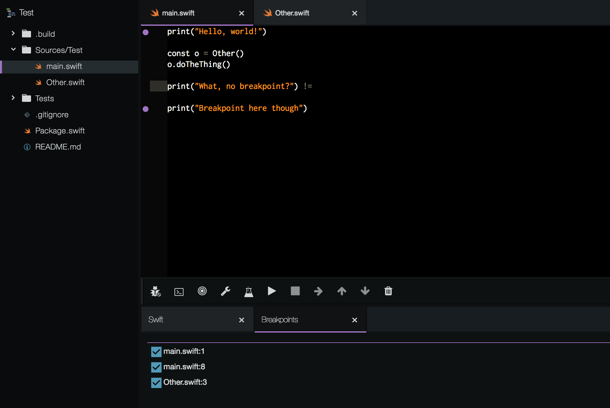
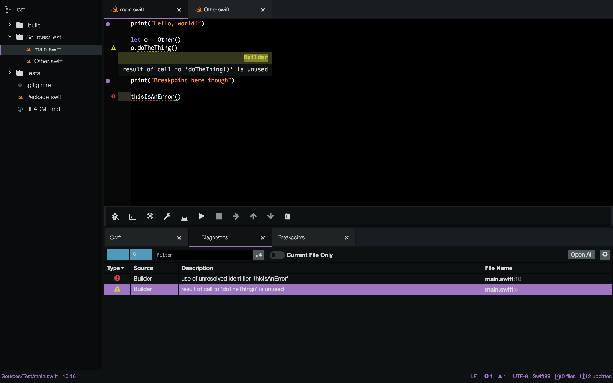

# Swift IDE

This is the very rough beginnings of an Atom IDE implementation for Swift.

What it allows you to do right now is:

- set breakpoints in your swift code
- build via (`swift build`)
- view a list of build warnings and errors
- launch your built application within lldb


It is very very basic, so please don't expect anything polished, and prepare yourself for all sorts of weirdness and confusion!

That said, by all means [file suggestions, comments and bug reports](https://github.com/elegantchaos/atom-ide-swift/issues).


### Background

This started life as a standalone hack which managed its own breakpoints, and launched and interacted with lldb on its own.

In the meantime, the [Atom IDE](https://ide.atom.io/) project has come along, providing some standardised capabilities and user interfaces for better integration of language features into Atom.

The long-term goal for this package is to migrate into adopting those capabilities.

However, at the moment it's still very rough, and the integration is minimal.

In fact, the only integrations that have been attempted so far are setting/viewing breakpoints, and viewing build warnings and errors.

The actual building and debugging process is handled with custom code.


### Supported Platforms

This package is being actively developed on Linux.

At this early stage of development it's only been tested on Ubuntu 18.04, and macOS 10.12.

On Ubuntu I'm using an unmodified version of swift/lldb built locally, roughly equivalent to Swift 4.2.

In theory the package should work fine on any platforms that has swift/lldb installed. If it doesn, [please let me know](https://github.com/elegantchaos/atom-ide-swift/issues).


### Package Dependencies

You need the following Atom packages:

- language-swift-89
- tool-bar
- atom-swift-ui

You can install these with:

```
apm install language-swift-89 atom-ide-ui tool-bar
```

### Usage

Make sure that the package dependencies are installed and enabled.

Go to the preferences for this package and enter paths for the `swift` and `lldb` executables. In theory they should get picked up from your path if you leave these settings blank, but at this early stage of the package's development, it's safer to enter them explicitly.

Open a Swift project - it needs to be one that builds with `swift build`.

Set some breakpoints in your source code, using the Atom IDE breakpoints UI.

Choose `Swift IDE` / `Debug` from the package menu.

Enter the name of the product you want to run in the debugger, by doing `e=NameOfYourProduct`

Hit the Run button.


### Breakpoints

The breakpoints are managed by the atom-ide code. You should be able to add them by clicking to the left of the gutter in any source file.

Open the command palette and select `Debugger: Show Window Breakpoints` to show a list of all breakpoints, and can manually move/dock this tab to bring it closer to the Swift/lldb repl.




### Diagnostics

If the build produces warnings or errors, they should show up in the diagnostics panel.



To get this panel to show, open the command palette and select `Diagnostics: Toggle Table`.


### Toolbar

The toolbar we're using is the one provided by the `tool-bar` package.


Note that there is also a toolbar, with debugger-ish looking buttons, provided by the Atom ID user interface.


Obviously that's the one we should be using, and integrating properly with it is high on the list of priorities.

For now though, don't let it fool you!

Just to add to the confusion, the Atom IDE user interface appears to add a couple of buttons to the toolbar that we _are_ using.

In the screenshot above, the first two buttons are actually the Atom IDE ones, and nothing to do with us!


### Caveat Emptor!

*The plan is obviously to integrate fully into the Atom IDE user interface, but note that currently*:

- the run/step/pause etc functionality is using our own tool bar (at the bottom of the screen in the screenshot)
- you may need to toggle the toolbar visible (`Toolbar: Toggle`)
- the only part of the Atom IDE UI that works are the breakpoints
- all interaction with lldb is via commands, typed into the Swift panel
- the first two buttons on the toolbar in the screenshot belong to atom-ide and not us!


### Credits

Most code by Sam Deane, Elegant Chaos.

Thanks to:

- the Swift and Atom teams, for so much awesome
- [@aciidb0mb3r](https://github.com/aciidb0mb3r/) for [swift-debugger](https://github.com/aciidb0mb3r/atom-swift-debugger), which got the ball rolling; a few traces of the swift-debugger code still linger in the current codebase
